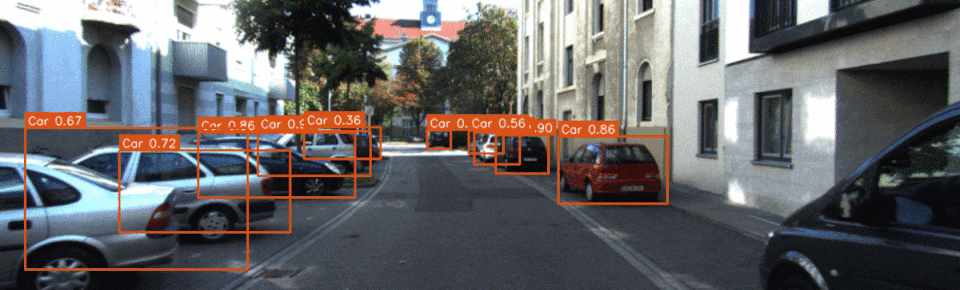
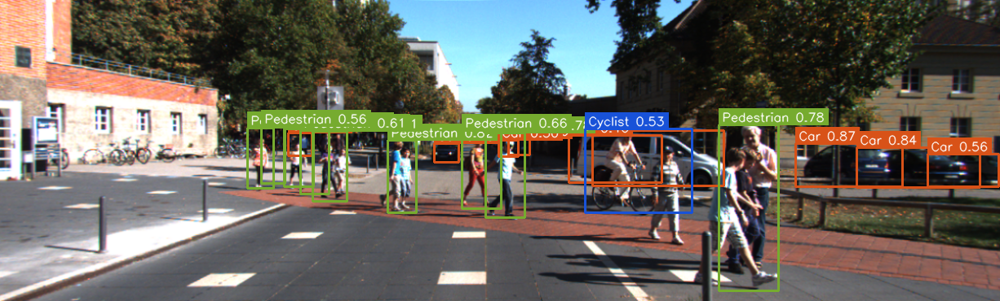
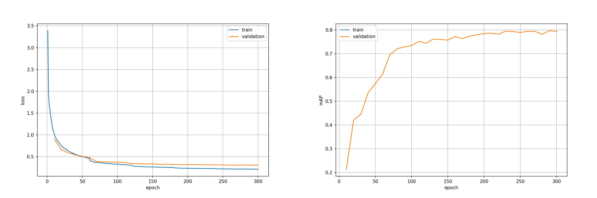

<div align="center">

</div>


# Introduction

An unofficial PyTorch reimplementation of [SqueezeDet](https://arxiv.org/abs/1612.01051), with better performance on KITTI benchmark than the official [Tensorflow version](https://github.com/BichenWuUCB/squeezeDet) (and cleaner codes!)

Currently only SqueezeDet architecture is supported. SqueezeDet+ is coming soon.


# Performance

### KITTI

|   Classes   |           Car (E/M/H)          |   Pedestrian (E/M/H)   |         Cyclist (E/M/H)        |     mAP    |
|-------------|--------------------------------|------------------------|--------------------------------|------------|
|  This repo  | **92.8** / **88.7** / **79.0** | 82.1 / 75.4 / **72.5** | **82.3** / **76.9** / **73.8** |  **80.4**  |
|    Paper    |        90.2 / 84.7 / 73.9      | **82.9** / 75.4 / 72.1 |       77.1 / 68.3 / 65.8       |    76.7    |


# Speed

### Training

KITTI dataset, 1248\*384 resolution:

|   Machine    |                    Time                     |
|--------------|---------------------------------------------|
|  V100 + SSD  |   ~36s/epoch (3740 images, 20 batch size)   |
|  1060 + HDD  |   ~95s/epoch (3740 images, 16 batch size)   |

### Inference

KITTI dataset, 1248\*384 resolution:

|   Machine    |                 Time                |
|--------------|-------------------------------------|
|  V100 + SSD  |  117FPS (8 threads, 20 batch size)  |
|  1060 + HDD  |  58FPS (4 threads, 20 batch size)   |


# Usage

### Environment

This project was developed and tested on Ubuntu 16.04, with Python 3.6 and PyTorch 1.1.0.

### Installation

Let's call the top level directory of this repo `$ROOT_DIR`.

- (Optional) Create a virtual conda environment or Docker container.

- Clone this repository:

  ```Shell
  git clone https://github.com/QiuJueqin/SqueezeDet-PyTorch.git
  ```

- Install requirements:

  ```Shell
  cd $ROOT_DIR
  pip install -r requirements.txt
  ```

### Run demo

Simply run:

```Shell
cd $ROOT_DIR/src
python main.py demo
```

That's it. All pre-trained model and sample images have been included in the repo. If everything goes well you will see detection results like this:

<div align="center">

</div>

By default we use CPU in demo mode. Set `gpus` to 0 in [demo.py](src/demo.py#L20) to use GPU.

### Training & evaluation

#### KITTI 2D object detection benchmark

- Download KITTI object detection dataset ([images](http://www.cvlibs.net/download.php?file=data_object_image_2.zip) and [labels](http://www.cvlibs.net/download.php?file=data_object_label_2.zip)) to your disk, unzip them and you will get two directories:  `training/` and `testing/`. Create a symbolic link to `data/kitti` of the working directory:

  ```Shell
  mkdir $ROOT_DIR/data/kitti
  ln -s training/ testing/ $ROOT_DIR/data/kitti
  ```

- Then read all samples' ID into a `trainval.txt` file:

  ```Shell
  cd $ROOT_DIR/data/kitti
  mkdir image_sets
  cd ./image_sets
  ls ../training/image_2/ | grep ".png" | sed s/.png// > trainval.txt
  ```

- Use the script to randomly split the KITTI's training data into a training set and a vlidation set half-and-half:

  ```Shell
  cd $ROOT_DIR/src/utils
  python random_split_train_val.py
  ```

  A `train.txt` and a `val.txt` files will be generated that record the sample IDs for training and validation sets. Now the structure of your data folder should look like:

  ```plain
  $ROOT_DIT/data/kitti/
                    |--training/
                    |     |-- image_2/00****.png
                    |     L-- label_2/00****.txt
                    |--testing/
                    |     L-- image_2/00****.png
                    L--image_sets/
                          |-- trainval.txt
                          |-- train.txt
                          L-- val.txt
  ```

- Before using KITTI's development kit to evaluate models, we need to compile it first:

  ```Shell
  cd $ROOT_DIR/src/utils/kitti-eval
  make
  ```

- To evaluate trained model on the validation set, run:
  
  ```Shell
  cd $ROOT_DIR/src
  python main.py eval --load_model ../models/squeezedet_kitti_epoch290.pth --exp_id my_eval
  ```

  and you will get results like this:

  ```
  Your evaluation results are available in /home/qiujueqin/squeezedet/exp/my_eval/results
  Car_easy             0.922
  Car_moderate         0.877
  Car_hard             0.784
  Pedestrian_easy      0.814
  Pedestrian_moderate  0.743
  Pedestrian_hard      0.718
  Cyclist_easy         0.816
  Cyclist_moderate     0.762
  Cyclist_hard         0.737
  mAP                  0.797
  ```

- To train the model, run:

  ```Shell
  python main.py train --load_model ../models/imagenet/squeezenet1_1-f364aa15.pth --exp_id my_train
  ```

  where `squeezenet1_1-f364aa15.pth` is a PyTorch official [SqueezeNet](https://pytorch.org/docs/stable/torchvision/models.html#id15) model pre-trained on ImageNet. We do not recommend to train SqueezeDet from scratch. All logs will be saved to `$ROOT_DIR/exp/my_train` directory.

  By default we use `batch_size=20` and `num_workers=4`. You can find more parameter options by running `python main.py --help`:

  ```Shell
  usage: main.py [-h] [--dataset DATASET] [--load_model LOAD_MODEL]
               [--debug DEBUG] [--exp_id EXP_ID] [--arch ARCH]
               [--dropout_prob DROPOUT_PROB] [--lr LR] [--momentum MOMENTUM]
               [--weight_decay WEIGHT_DECAY] [--grad_norm GRAD_NORM]
               [--num_epochs NUM_EPOCHS] [--num_iters NUM_ITERS]
               [--batch_size BATCH_SIZE]
               [--master_batch_size MASTER_BATCH_SIZE]
               [--save_intervals SAVE_INTERVALS]
               [--val_intervals VAL_INTERVALS] [--no_eval]
               [--print_interval PRINT_INTERVAL] [--flip_prob FLIP_PROB]
               [--drift_prob DRIFT_PROB] [--forbid_resize]
               [--class_loss_weight CLASS_LOSS_WEIGHT]
               [--positive_score_loss_weight POSITIVE_SCORE_LOSS_WEIGHT]
               [--negative_score_loss_weight NEGATIVE_SCORE_LOSS_WEIGHT]
               [--bbox_loss_weight BBOX_LOSS_WEIGHT] [--nms_thresh NMS_THRESH]
               [--score_thresh SCORE_THRESH] [--keep_top_k KEEP_TOP_K]
               [--gpus GPUS] [--num_workers NUM_WORKERS]
               [--not_cuda_benchmark] [--seed SEED]
               mode
  ...               
  ```

  Here are loss curve and mAP curve from one training process:

  <div align="center">
  
  </div>

### Train on your own dataset

- Create a dataset class inherited from [`BaseDataset`](src/datasets/base.py#L10), with your own images and annotations loading methods. See [kitti.py](src/datasets/kitti.py) for reference.

- Register new dataset in [`load_dataset`](src/utils/misc.py#L19) function.

- Compute dataset's rgb mean and rgb std values by running:

  ```Shell
  cd $ROOT_DIR/src/utils
  python compute_dataset_mean_and_std.py
  ```

- Compute dataset's optimal anchors seed by running:

  ```Shell
  cd $ROOT_DIR/src/utils
  python compute_dataset_seed_anchors.py
  ```

- Start training:

  ```Shell
  cd $ROOT_DIR/src
  python main.py train --dataset YOUR_DATASET
  ```


# License

Copyright 2020 Qiu Jueqin

Licensed under [MIT](http://opensource.org/licenses/MIT).